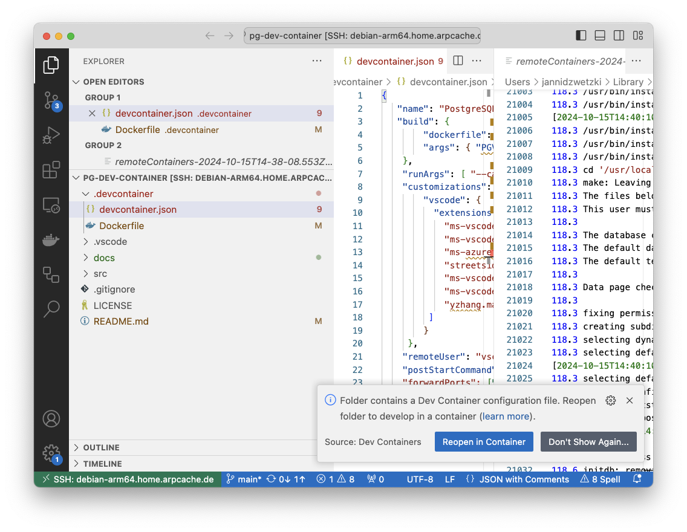
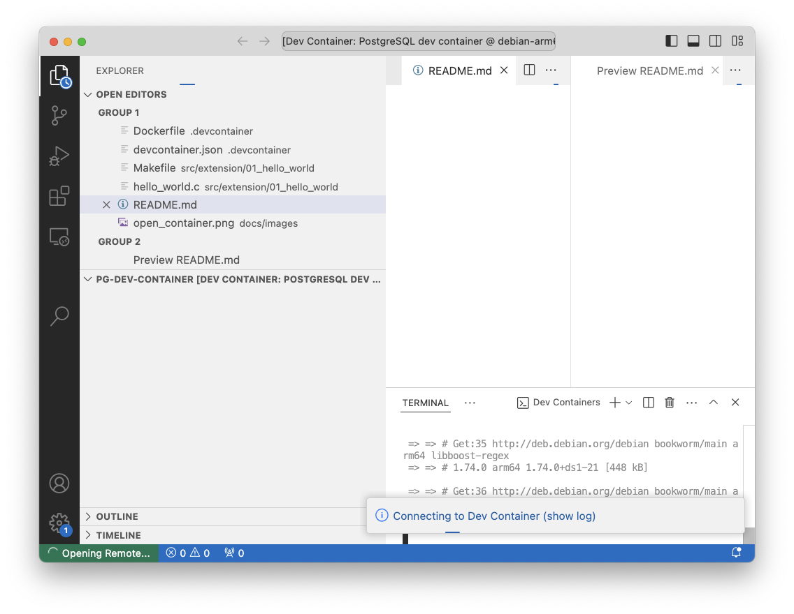
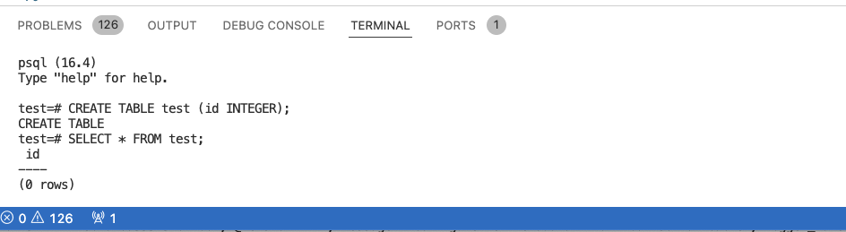
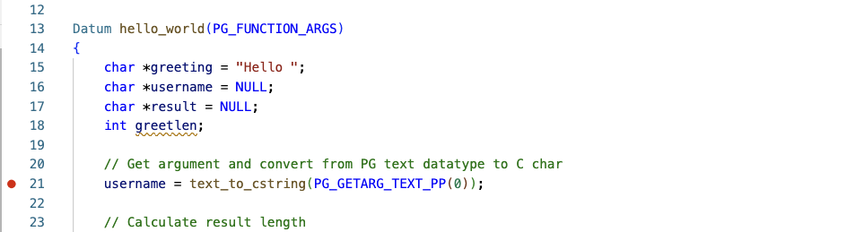

# VS Studio Code - Development Container - PostgreSQL

This project provides a VS Studio Code [development container](https://code.visualstudio.com/docs/devcontainers/containers) for PostgreSQL. This container contains all the needed tools to debug PostgreSQL as well as a PostgreSQL build that is compiled without optimizations, enabled assertions, and debug symbols. This PostgreSQL build is obviously slower than production build but allows it to develop and test PostgreSQL extensions. For instance, the build performs checks to catch programming mistakes due to the enabled assertions (`USE_ASSERT_CHECKING`) and cleaning freed memory early (`CLOBBER_FREED_MEMORY`). The created debug symbols and the missing optimizations make it easily to attach with a debugger to this instance.

## Prerequisites

To use the development container, the following prerequisites have to be meet:

* VSCode is [installed](https://code.visualstudio.com/Download)
* Docker is [installed](https://code.visualstudio.com/docs/devcontainers/tutorial#_install-docker)

## Open the Project

After the prerequisites are meet, the VSCode project can be opened. After the project is loaded, VSCode asks if the project should be `Reopened in Container`. This option should be selected.



Afterward, VSCode starts to download the needed base container image, installs the needed tools and compiles PostgreSQL. This steps might _need some time_ to complete. By clicking on the `show log` link, details about the build process are shown.



## First Start

After the container is build, the PostgreSQL source code that is part of the development container should be added to VSCode This allows it to browse the source code and perform full text search from VSCode as well. To import the source code, a new terminal should be opened and the following command can be executed:

```
code --add /usr/local/src/postgresql
```

_Note:_ VSCode might need to reload the windows after the command is executed.

For example, you can search for the PostgreSQL function `add_path()` after the header files (`.h`) of the  source code is added to VSCode and you should find some matches.


### Connecting to the PostgreSQL server

The development container automatically starts the PostgreSQL server when the container is executed. Using the integrated terminal, you can connect to this PostgreSQL server after you have created a database using `createdb`. For example, the following commands create a database, connect to the database, create a table, perform a `SELECT` statement and delete the database.

```
createdb test
psql test
CREATE TABLE test (id INTEGER);
SELECT * FROM test;
quit
dropdb test
```



### Installing the First Extension

The container contains also a simple `hello_world` PostgreSQL extension which provides the function `hello_world(TEXT)`. The function takes a parameter of the type `TEXT`  and returns `Hello %PARAMETER` also as a `TEXT`. The source code of the extension can be found in the `src/extension/01_hello_world/` directory.

To install and test the extension, you need to change into the directory of the extension. Afterward you can compile it by running `make`. This builds the library `hello_world.so`. By running `sudo make install` the library is copied into the `lib` folder of the database server and helper files are copied into the `extensions` directory of PostgreSQL. The command needs to be prefixed with `sudo` since only root has write permissions on these directories. After the extension is installed it can be tested. By running `make installcheck` a new database is created and the test statements of the file `test/sql/00_hello.sql` are executed and the results are compared with the output stored in `test/expected/00_hello.out`.

```
cd src/extension/01_hello_world/
make
sudo make install
make installcheck
```

The extension can be also tested interactively. To use it, a new database needs to be created first:

```
createdb test
psql test
```

Afterward, the extension should be available for installation. This can be verified by the following command:

```sql
SELECT * FROM pg_available_extensions;

name     | default_version | installed_version |                      comment                       
--------------+-----------------+-------------------+----------------------------------------------------
 postgres_fdw | 1.1             |                   | foreign-data wrapper for remote PostgreSQL servers
 plpgsql      | 1.0             | 1.0               | PL/pgSQL procedural language
 hello_world  | 1.0             |                   | Simple hello world extension
(3 rows)
```

It shows that the extensions `postgres_fdw`, `plpgsql`, and `hello_world` are known by the database server.

By executing:

```sql
CREATE EXTENSION hello_world;
```

the extension can be installed in the current database. By executing `\dx` (a helper command provided by `psql`), the installed extensions are listed:

```
\dx
                   List of installed extensions
    Name     | Version |   Schema   |         Description          
-------------+---------+------------+------------------------------
 hello_world | 1.0     | public     | Simple hello world extension
 plpgsql     | 1.0     | pg_catalog | PL/pgSQL procedural language
(2 rows)
```

During the installation, the content of the install script of the extension `hello_world--1.0.sql` is executed. The script registers a new function in the catalog of the database and also defines the entry point in the C code. In other words, the function is known at the SQL level afterward and PostgreSQL knows that it should call the implementation in our extension. By running the helper command `\df+ hello_world` the information about the function can be retrieved from the catalog.

```sql
\df+ hello_world

 Schema |    Name     | Result data type | Argument data types | Type | Volatility | Parallel | Owner  | Security | Access privileges | Language | Internal name | Description 
--------+-------------+------------------+---------------------+------+------------+----------+--------+----------+-------------------+----------+---------------+-------------
 public | hello_world | text             | text                | func | volatile   | unsafe   | vscode | invoker  |                   | c        | hello_world   | 
```

The function can now be called:

```sql
select hello_world('Mr X');

 hello_world 
-------------
 Hello Mr X
(1 row)
```

### Using the Debugger
To debug the extension, the source code `hello_world.c` needs to be opened. Afterward, a break point can be set by simply on the dot right of the line number.



To stop the execution at this point, open a new connection to the database server by running `psql test` from the terminal.


_Note:_ You can also switch to the the implementation of the used functions by pressing `F12`. For example, click on the function `text_to_cstring` and press `F12` afterward. The file `varlena.c` of the PostgreSQL source code is opened in a new tab and the cursor is moved to the function definition.